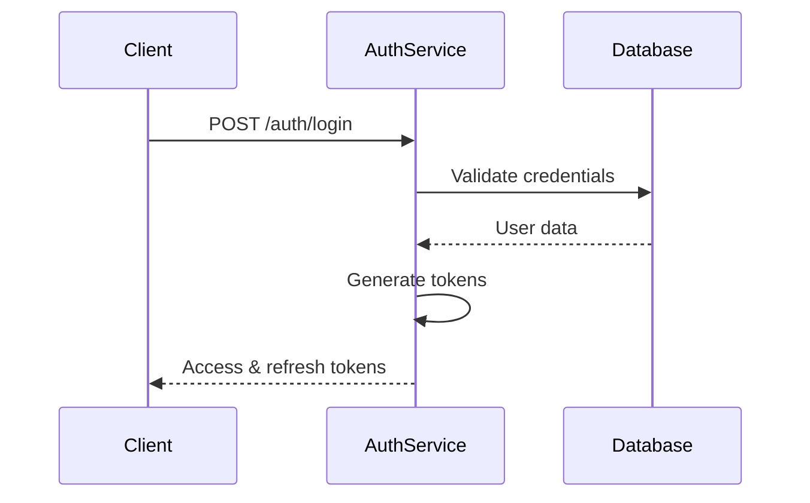
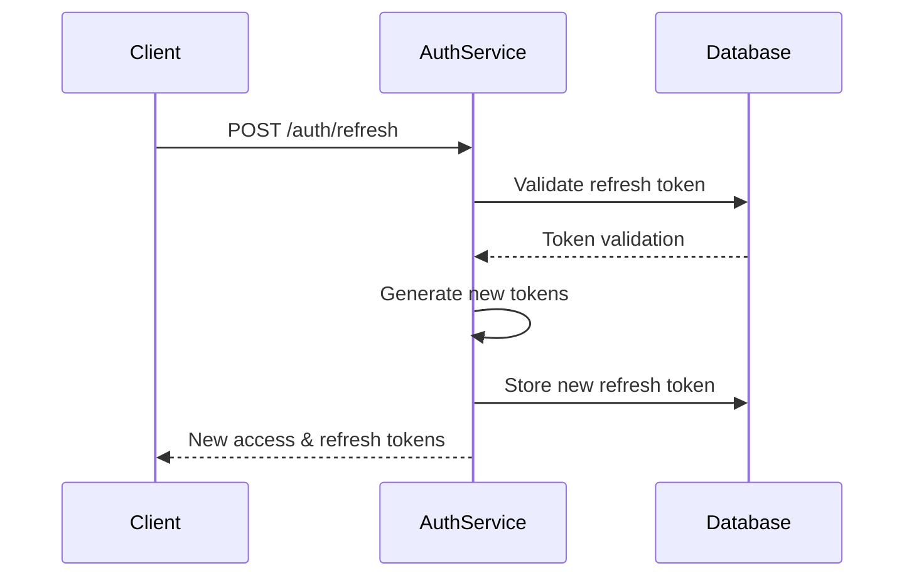
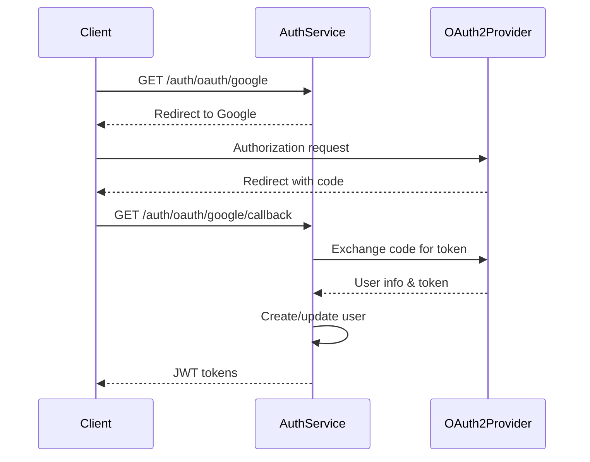

# Authentication API Endpoints Documentation

## Overview

This document provides detailed information about the Authentication Service API endpoints, including request/response formats, authentication flows, and error handling.

## Base Configuration

### Service Information

- **Base URL**: `http://localhost:3001` (development)
- **Production URL**: `https://api.social-tippster.com/auth`
- **API Version**: v1
- **Content-Type**: `application/json`

### Authentication Headers

```http
Authorization: Bearer <access_token>
Content-Type: application/json
```

## Core Authentication Endpoints

### 1. User Registration

#### `POST /auth/register`

Registers a new user in the system.

**Request Body:**

```json
{
  "email": "user@example.com",
  "password": "SecurePassword123!",
  "firstName": "John",
  "lastName": "Doe",
  "username": "johndoe",
  "agreeToTerms": true
}
```

**Response (201 Created):**

```json
{
  "success": true,
  "message": "User registered successfully",
  "data": {
    "user": {
      "id": "uuid-string",
      "email": "user@example.com",
      "firstName": "John",
      "lastName": "Doe",
      "username": "johndoe",
      "role": "user",
      "isActive": true,
      "createdAt": "2024-01-01T00:00:00.000Z"
    },
    "tokens": {
      "accessToken": "eyJhbGciOiJSUzI1NiIsInR5cCI6IkpXVCJ9...",
      "refreshToken": "refresh-token-string",
      "expiresIn": 900
    }
  }
}
```

**Validation Rules:**

- `email`: Valid email format, unique
- `password`: Minimum 8 characters, complexity requirements
- `firstName`, `lastName`: 2-50 characters, letters only
- `username`: 3-30 characters, alphanumeric and underscore
- `agreeToTerms`: Must be true

### 2. User Login

#### `POST /auth/login`

Authenticates a user and returns tokens.

**Request Body:**

```json
{
  "email": "user@example.com",
  "password": "SecurePassword123!",
  "rememberMe": false
}
```

**Response (200 OK):**

```json
{
  "success": true,
  "message": "Login successful",
  "data": {
    "user": {
      "id": "uuid-string",
      "email": "user@example.com",
      "firstName": "John",
      "lastName": "Doe",
      "username": "johndoe",
      "role": "user",
      "lastLoginAt": "2024-01-01T00:00:00.000Z"
    },
    "tokens": {
      "accessToken": "eyJhbGciOiJSUzI1NiIsInR5cCI6IkpXVCJ9...",
      "refreshToken": "refresh-token-string",
      "expiresIn": 900
    }
  }
}
```

### 3. Token Refresh

#### `POST /auth/refresh`

Refreshes an access token using a valid refresh token.

**Request Body:**

```json
{
  "refreshToken": "refresh-token-string"
}
```

**Response (200 OK):**

```json
{
  "success": true,
  "message": "Token refreshed successfully",
  "data": {
    "accessToken": "eyJhbGciOiJSUzI1NiIsInR5cCI6IkpXVCJ9...",
    "refreshToken": "new-refresh-token-string",
    "expiresIn": 900
  }
}
```

### 4. Token Validation

#### `POST /auth/validate`

Validates an access token and returns user information.

**Headers:**

```http
Authorization: Bearer <access_token>
```

**Response (200 OK):**

```json
{
  "success": true,
  "message": "Token is valid",
  "data": {
    "user": {
      "id": "uuid-string",
      "email": "user@example.com",
      "role": "user",
      "permissions": ["read:posts", "write:posts"]
    },
    "tokenInfo": {
      "issuedAt": "2024-01-01T00:00:00.000Z",
      "expiresAt": "2024-01-01T00:15:00.000Z",
      "remainingTime": 750
    }
  }
}
```

### 5. User Logout

#### `POST /auth/logout`

Logs out a user and invalidates their tokens.

**Headers:**

```http
Authorization: Bearer <access_token>
```

**Request Body (Optional):**

```json
{
  "refreshToken": "refresh-token-string",
  "logoutAllDevices": false
}
```

**Response (200 OK):**

```json
{
  "success": true,
  "message": "Logout successful"
}
```

## Password Management Endpoints

### 6. Password Reset Request

#### `POST /auth/password/reset-request`

Initiates a password reset process.

**Request Body:**

```json
{
  "email": "user@example.com"
}
```

**Response (200 OK):**

```json
{
  "success": true,
  "message": "Password reset email sent if account exists"
}
```

### 7. Password Reset Confirmation

#### `POST /auth/password/reset-confirm`

Completes the password reset process.

**Request Body:**

```json
{
  "token": "reset-token-from-email",
  "newPassword": "NewSecurePassword123!"
}
```

**Response (200 OK):**

```json
{
  "success": true,
  "message": "Password reset successfully"
}
```

### 8. Password Change

#### `POST /auth/password/change`

Changes password for an authenticated user.

**Headers:**

```http
Authorization: Bearer <access_token>
```

**Request Body:**

```json
{
  "currentPassword": "CurrentPassword123!",
  "newPassword": "NewSecurePassword123!"
}
```

**Response (200 OK):**

```json
{
  "success": true,
  "message": "Password changed successfully"
}
```

## Account Management Endpoints

### 9. Account Verification

#### `POST /auth/verify-email`

Verifies user email address.

**Request Body:**

```json
{
  "token": "verification-token-from-email"
}
```

**Response (200 OK):**

```json
{
  "success": true,
  "message": "Email verified successfully",
  "data": {
    "user": {
      "id": "uuid-string",
      "email": "user@example.com",
      "isEmailVerified": true
    }
  }
}
```

### 10. Resend Verification Email

#### `POST /auth/resend-verification`

Resends email verification.

**Request Body:**

```json
{
  "email": "user@example.com"
}
```

**Response (200 OK):**

```json
{
  "success": true,
  "message": "Verification email sent if account exists"
}
```

## OAuth2 Endpoints

### 11. OAuth2 Authorization

#### `GET /auth/oauth/{provider}`

Initiates OAuth2 flow with external provider.

**Parameters:**

- `provider`: google, facebook, github, etc.

**Response (302 Redirect):**
Redirects to OAuth2 provider authorization URL.

### 12. OAuth2 Callback

#### `GET /auth/oauth/{provider}/callback`

Handles OAuth2 callback and completes authentication.

**Query Parameters:**

- `code`: Authorization code from provider
- `state`: CSRF protection state parameter

**Response (302 Redirect):**
Redirects to frontend with tokens in URL fragments or as HTTP-only cookies.

## Administrative Endpoints

### 13. User Status Management

#### `POST /auth/admin/users/{userId}/status`

Updates user account status (admin only).

**Headers:**

```http
Authorization: Bearer <admin_access_token>
```

**Request Body:**

```json
{
  "status": "active", // active, suspended, banned
  "reason": "Account restored after review"
}
```

**Response (200 OK):**

```json
{
  "success": true,
  "message": "User status updated successfully",
  "data": {
    "userId": "uuid-string",
    "status": "active",
    "updatedAt": "2024-01-01T00:00:00.000Z"
  }
}
```

### 14. Force Logout User

#### `POST /auth/admin/users/{userId}/force-logout`

Forces logout for a specific user (admin only).

**Headers:**

```http
Authorization: Bearer <admin_access_token>
```

**Response (200 OK):**

```json
{
  "success": true,
  "message": "User logged out successfully"
}
```

## Health and Status Endpoints

### 15. Health Check

#### `GET /health`

Returns service health status.

**Response (200 OK):**

```json
{
  "status": "ok",
  "service": "auth-service",
  "timestamp": "2024-01-01T00:00:00.000Z",
  "version": "1.0.0",
  "dependencies": {
    "database": "ok",
    "redis": "ok"
  }
}
```

### 16. Service Information

#### `GET /auth/info`

Returns service information and capabilities.

**Response (200 OK):**

```json
{
  "service": "auth-service",
  "version": "1.0.0",
  "features": [
    "jwt-authentication",
    "refresh-tokens",
    "oauth2",
    "email-verification",
    "password-reset"
  ],
  "oauthProviders": ["google", "facebook", "github"],
  "tokenExpiry": {
    "accessToken": "15m",
    "refreshToken": "7d"
  }
}
```

## Error Responses

### Standard Error Format

```json
{
  "success": false,
  "error": {
    "code": "VALIDATION_ERROR",
    "message": "Invalid input data",
    "details": [
      {
        "field": "email",
        "message": "Invalid email format"
      },
      {
        "field": "password",
        "message": "Password must be at least 8 characters"
      }
    ]
  },
  "timestamp": "2024-01-01T00:00:00.000Z",
  "path": "/auth/register"
}
```

### Common Error Codes

#### Authentication Errors (4xx)

- `400 BAD_REQUEST`: Invalid request data
- `401 UNAUTHORIZED`: Invalid credentials or token
- `403 FORBIDDEN`: Insufficient permissions
- `404 NOT_FOUND`: User or resource not found
- `409 CONFLICT`: Email or username already exists
- `422 UNPROCESSABLE_ENTITY`: Validation errors
- `429 TOO_MANY_REQUESTS`: Rate limit exceeded

#### Server Errors (5xx)

- `500 INTERNAL_SERVER_ERROR`: General server error
- `502 BAD_GATEWAY`: Upstream service error
- `503 SERVICE_UNAVAILABLE`: Service temporarily unavailable

### Specific Error Examples

#### Invalid Credentials

```json
{
  "success": false,
  "error": {
    "code": "INVALID_CREDENTIALS",
    "message": "Invalid email or password"
  }
}
```

#### Token Expired

```json
{
  "success": false,
  "error": {
    "code": "TOKEN_EXPIRED",
    "message": "Access token has expired",
    "details": {
      "expiredAt": "2024-01-01T00:15:00.000Z",
      "currentTime": "2024-01-01T00:16:00.000Z"
    }
  }
}
```

#### Account Locked

```json
{
  "success": false,
  "error": {
    "code": "ACCOUNT_LOCKED",
    "message": "Account temporarily locked due to multiple failed login attempts",
    "details": {
      "lockoutExpires": "2024-01-01T01:00:00.000Z",
      "remainingTime": 3600
    }
  }
}
```

#### Rate Limit Exceeded

```json
{
  "success": false,
  "error": {
    "code": "RATE_LIMIT_EXCEEDED",
    "message": "Too many requests. Please try again later",
    "details": {
      "retryAfter": 60,
      "limit": 5,
      "windowMs": 900000
    }
  }
}
```

## Authentication Flow Examples

### Standard Login Flow



### Token Refresh Flow



### OAuth2 Flow



## API Testing

### Example cURL Commands

#### Registration

```bash
curl -X POST http://localhost:3001/auth/register \
  -H "Content-Type: application/json" \
  -d '{
    "email": "test@example.com",
    "password": "SecurePassword123!",
    "firstName": "Test",
    "lastName": "User",
    "username": "testuser",
    "agreeToTerms": true
  }'
```

#### Login

```bash
curl -X POST http://localhost:3001/auth/login \
  -H "Content-Type: application/json" \
  -d '{
    "email": "test@example.com",
    "password": "SecurePassword123!"
  }'
```

#### Token Validation

```bash
curl -X POST http://localhost:3001/auth/validate \
  -H "Authorization: Bearer <access_token>"
```

### Postman Collection

A Postman collection is available for testing all endpoints:

- Import the collection from `/docs/postman/auth-service.postman_collection.json`
- Set up environment variables for base URL and tokens
- Run the collection for automated testing

## Rate Limiting

### Endpoint-Specific Limits

| Endpoint                       | Limit        | Window     | Block Duration |
| ------------------------------ | ------------ | ---------- | -------------- |
| `/auth/login`                  | 5 attempts   | 15 minutes | 15 minutes     |
| `/auth/register`               | 3 attempts   | 1 hour     | 1 hour         |
| `/auth/password/reset-request` | 3 attempts   | 1 hour     | 1 hour         |
| `/auth/refresh`                | 10 requests  | 1 minute   | 1 minute       |
| `/auth/validate`               | 100 requests | 1 minute   | 1 minute       |

### Rate Limit Headers

Responses include rate limit information:

```http
X-RateLimit-Limit: 5
X-RateLimit-Remaining: 4
X-RateLimit-Reset: 1640995200
X-RateLimit-Window: 900
```

## Monitoring and Metrics

### Key Metrics Tracked

- Authentication success/failure rates
- Token generation and validation counts
- Password reset request volumes
- OAuth2 provider usage statistics
- Rate limit violations
- Response times and error rates

### Health Monitoring

The service exposes Prometheus metrics at `/metrics`:

- `auth_requests_total{method, endpoint, status}`
- `auth_request_duration_seconds{method, endpoint}`
- `auth_tokens_generated_total{type}`
- `auth_tokens_validated_total{status}`
- `auth_rate_limit_exceeded_total{endpoint}`
