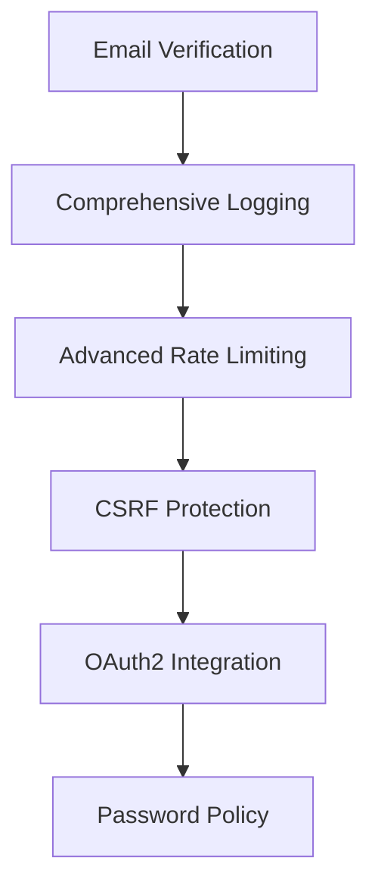

# Authentication Service Hiányzó Funkciók és Fejlesztési Lehetőségek

> **Utolsó frissítés:** 2025. június 11.
> **Cél:** [`backend_new/services/auth`](../../../backend_new/services/auth) mikroszerviz fejlesztési roadmap

Áttekintve a [`backend_new/services/auth`](../../../backend_new/services/auth) mappát, íme a **hiányzó funkciók** és **fejlesztési lehetőségek**:

---

## 🚨 Kritikus Hiányosságok

### 1. **Multi-Factor Authentication (2FA)**

```typescript
// Jelenleg nincs implementálva:
- TOTP (Time-based One-Time Password)
- SMS verification
- Email verification codes
- Backup codes
```

### 2. **OAuth2/Social Login**

```typescript
// Hiányzó provider integráció:
- Google OAuth
- Facebook Login
- GitHub Authentication
- Microsoft/Azure AD
```

### 3. **Advanced Rate Limiting**

```typescript
// Alapvető throttling van, de hiányzik:
- IP-based rate limiting
- User-specific rate limiting
- Geolocation-based restrictions
- Suspicious activity detection
```

### 4. **Password Policy Enforcement**

```typescript
// Nincs implementálva:
- Minimum complexity requirements
- Password history checking
- Forced password rotation
- Breach detection (HaveIBeenPwned integration)
```

---

## 🔐 Biztonsági Fejlesztések

### 5. **Advanced Session Management**

```typescript
// Jelenlegi session kezelés alapszintű, hiányzik:
- Device fingerprinting
- Geolocation tracking
- Concurrent session limits
- Session hijacking detection
```

### 6. **Account Security Features**

```typescript
// Hiányzó biztonsági funkciók:
- Account lockout policies
- Failed login notifications
- Login location alerts
- Security audit logs
```

### 7. **CSRF és Security Headers**

```typescript
// Nincs implementálva:
- CSRF token validation
- Security headers middleware
- Content Security Policy
- XSS protection
```

---

## 📧 Email és Kommunikáció

### 8. **Email Verification System**

```typescript
// Teljes email rendszer hiányzik:
- Registration email verification
- Email change confirmation
- Welcome emails
- Security notification emails
```

### 9. **Password Reset Flow**

```typescript
// Alapvető reset van, de hiányzik:
- Secure token generation
- Email-based reset flow
- Reset attempt limiting
- Reset notification system
```

---

## 🏗️ Infrastruktúra és Monitorozás

### 10. **Comprehensive Logging**

```typescript
// Hiányzó logging:
- Structured logging (Winston/Pino)
- Security event logging
- Performance metrics
- Error tracking integration
```

### 11. **Metrics és Monitoring**

```typescript
// Nincs implementálva:
- Prometheus metrics
- Health check improvements
- Performance monitoring
- Alert system integration
```

### 12. **Advanced Configuration**

```typescript
// Hiányzó konfiguráció:
- Environment-specific settings
- Feature flags
- Dynamic configuration
- Secrets management
```

---

## 🧪 Testing és Validáció

### 13. **Comprehensive Test Coverage**

```typescript
// Hiányzó tesztek:
- Unit tests minden service-hez
- Integration tests
- E2E authentication flows
- Security penetration tests
```

### 14. **Input Validation**

```typescript
// Fejleszthető validáció:
- Advanced email validation
- Phone number validation
- Stronger password validation
- Request sanitization
```

---

## 🚀 Fejlett Funkciók

### 15. **API Key Management**

```typescript
// Hiányzó API funkciók:
- API key generation
- API rate limiting
- API usage analytics
- API versioning support
```

### 16. **Advanced User Management**

```typescript
// Hiányzó user funkciók:
- User role management
- Permission system
- User profile management
- Account deletion/deactivation
```

### 17. **Audit Trail**

```typescript
// Nincs implementálva:
- User action logging
- Admin action tracking
- Data change history
- Compliance reporting
```

---

## 📱 Modern Authentication

### 18. **Passwordless Authentication**

```typescript
// Hiányzó modern auth:
- Magic link login
- WebAuthn/FIDO2
- Biometric authentication
- Push notifications
```

### 19. **Progressive Web App Support**

```typescript
// PWA integráció:
- Service worker authentication
- Offline token handling
- Background sync
```

---

## 🔄 Integráció és Kompatibilitás

### 20. **Microservice Integration**

```typescript
// Hiányzó mikroszerviz funkciók:
- Service-to-service authentication
- Token delegation
- Cross-service session sharing
- API Gateway integration
```

---

## 🎯 Azonnal Implementálandó Prioritások

### **High Priority** ⚡ (1-2 hét)

1. **Email Verification System** - Kritikus biztonsági funkció
2. **Comprehensive Logging** - Debugging és monitoring alapja
3. **Advanced Rate Limiting** - Brute force védelem
4. **CSRF Protection** - Alapvető web biztonsági funkció

### **Medium Priority** ⭐ (1 hónap)

5. **OAuth2 Integration** - Modern login lehetőségek
6. **Password Policy Enforcement** - Erős jelszó követelmények
7. **Advanced Session Management** - Biztonságos session kezelés
8. **Comprehensive Testing** - Minőségbiztosítás

### **Low Priority** 🔮 (2-3 hónap)

9. **Multi-Factor Authentication** - Fejlett biztonsági réteg
10. **Passwordless Authentication** - Modern UX megoldások
11. **API Key Management** - Harmadik fél integráció
12. **Audit Trail System** - Compliance és nyomon követés

---

## 💡 Következő Lépés Javaslat

### **Javasolt Kezdés: Email Verification System**

Kezdjük az **Email Verification System** implementálásával, mivel ez:

✅ **Kritikus biztonsági funkció** - Felhasználói fiókok biztonsága
✅ **Más funkciók alapját képezi** - Password reset, notifications
✅ **Viszonylag egyszerű implementáció** - 1-2 hét alatt elkészíthető
✅ **Azonnali értéket ad a rendszernek** - Production ready auth

### **Implementációs Sorrend:**



### **Technikai Stack Javaslat:**

- **Email Service**: NodeMailer + SendGrid/AWS SES
- **Template Engine**: Handlebars/Mustache
- **Queue System**: Redis + Bull Queue
- **Logging**: Winston + structured logging
- **Monitoring**: Prometheus + Grafana

---

## 📊 Fejlesztési Metrikák

| Kategória               | Jelenleg | Cél (3 hónap) | Prioritás   |
| ----------------------- | -------- | ------------- | ----------- |
| **Biztonsági Funkciók** | 30%      | 90%           | ⚡ Magas    |
| **Test Coverage**       | 20%      | 85%           | ⭐ Közepes  |
| **Modern Auth**         | 40%      | 80%           | 🔮 Alacsony |
| **Monitoring**          | 10%      | 95%           | ⚡ Magas    |

---

## 🔗 Kapcsolódó Dokumentációk

- [Authentication Service Áttekintő](./auth-service-overview.md)
- [Biztonsági Követelmények](../../technical/SECURITY.md)
- [Testing Stratégia](../../project-management/TESTING.md)
- [API Dokumentáció](../../implementation-reports/API.md)

---

_Ez a dokumentum a Social Tippster projekt authentication mikroszervizének fejlesztési roadmap-ja. Regular frissítések szükségesek a fejlesztési progress alapján._
